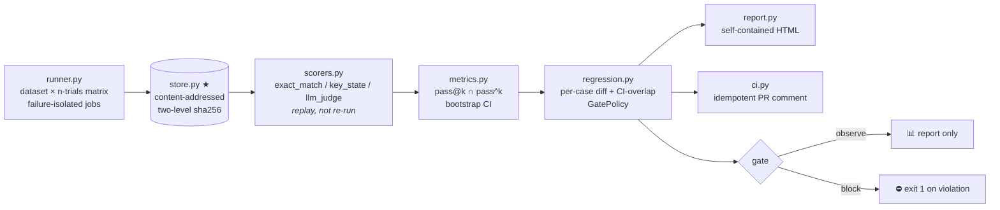

<div align="center">

# AgentLens

**Regression gates & stability metrics for LLM agents —
it answers exactly one question: *can this change be merged?***

[](https://www.python.org/)
[](#measured-status)
[](https://docs.astral.sh/ruff/)
[](https://docs.astral.sh/uv/)
[](#free-resource-red-line)

**English** · [简体中文](README.zh-CN.md)

Not another Langfuse. Langfuse tells you *what happened*;
AgentLens tells you whether *to merge*.

</div>

---

## Why

Single-run evals of LLM agents are noise: one pass@1 fluctuates by percentage points
across identical reruns. Merging (or blocking) an agent change on a point estimate is
coin-flipping with extra steps. AgentLens turns evaluation into a **gate** with the
statistics, the audit trail, and the judge accountability built in:

| Without AgentLens | With AgentLens |
|---|---|
| One run, one number, vibes-based review | `n`-trial distributions: pass@k (optimistic bound) **and** pass^k (pessimistic bound) reported together |
| Logs scattered across dashboards | Every trajectory content-addressed (sha256) — tamper-evident, deduplicated, replayable |
| "The judge model said so" | Judge calibration loop: Cohen's κ, position-swap, false-block rate — **with hard prerequisites before a judge may block** |
| Scorer bugs discovered in production | Scorers must pass TRAIL-style meta-eval (perfect discrimination on known-good/bad) before going on duty |

## Core principles (non-negotiable)

1. **Store trajectory first, judge later.** Trajectories hit disk content-addressed
   *before* any scoring; scoring is a replay over history. Swapping judges and
   re-scoring (`lens rescore`) is a first-class operation, never a re-run.
2. **Dual-sided distribution sandwich.** pass@k (Codex unbiased estimator, optimistic)
   and pass^k (tau-bench pessimistic) always travel together. Small "improvements"
   that are pure noise become visually obvious.
3. **Tiered gating.** `observe` mode reports and never blocks; flipping `llm_judge`
   to `block` requires passing documented prerequisites
   ([judge-block-policy](docs/judge-block-policy.md): κ ≥ 0.6, false-block ≤ 2%,
   swap ≥ 95%, …). Rule scorers may block directly.
4. **Judging decoupled from execution.** Scorers consume `Trajectory + task` only;
   every scorer must be offline-testable; all LLM access goes through the provider
   abstraction.

## Architecture



<details>
<summary><b>Module map</b> (click to expand)</summary>

| Module | Role |
|---|---|
| `store.py` ★ | Content-addressed trajectory store (two-level sha256 + run-level index); same-content dedup for free |
| `runner.py` | Dataset × n-trials concurrent matrix; network errors counted separately from task failures |
| `scorers.py` | `exact_match` (numeric-tolerant) / `key_state` (BFCL V3-style state matching) / `llm_judge` |
| `metrics.py` | pass@k unbiased estimator / pass^k pessimistic bound / bootstrap CI — hand-computed regression tests pin the math |
| `regression.py` | Case-level diff (improved/regressed/fragile/unchanged) + `GatePolicy{observe, block}` |
| `calibration.py` ★ | Judge calibration loop: 210-item constructed ground-truth pool → stratified pre-labeling → human review page → κ report |
| `judge_lab.py` | Cohen's κ, position-swap consistency, length-bias check |
| `meta_eval.py` | TRAIL-style scorer self-check: imperfect discrimination ⇒ off duty (includes security scorer) |
| `robustness.py` | InjecAgent-style tool-output injection suite; utility rate + attack success rate dual metrics |
| `trace_analyzer.py` | Failure-trajectory clustering (tool/format/planning/empty) |
| `export.py` | Rollout export: Harbor-style JSONL / AgentRL-Lab schema / OTel collector push — the eval→RL flywheel outlet |
| `ci.py` | Gate JSON → idempotent GitHub PR comment upsert |
| `report.py` | Self-contained HTML report (inlined CSS, cost accounting, per-case bootstrap CIs) |
| `ui.py` | Read-only local web UI: runs list / replay detail / gate compare (stdlib-only, binds 127.0.0.1) |

</details>

## Quick start

```bash
git clone git@github.com:EthyleneC2H4/agent-lens.git && cd agent-lens
uv sync                        # uv-managed; lockfile committed
uv run pytest -q               # 94 offline deterministic tests, zero network
uv run lens demo               # two-version eval → report → gate, EXIT=0
uv run lens ui                 # read-only local web UI → http://127.0.0.1:8517
```

Local end-to-end gate simulation (no GitHub required):

```bash
uv run lens run --version base --n-trials 5 --store-dir /tmp/demo-store
uv run lens run --version cand --n-trials 5 --store-dir /tmp/demo-store
uv run lens gate --store-dir /tmp/demo-store --mode block --out-json gate.json
uv run python scripts/pr_comment.py --gate-json gate.json   # dry-render the PR comment
```

### Evaluating your own agent

Any Python callable can be the system under test — the factory returns a solver,
the runner handles concurrency, seeds, and failure isolation:

```bash
uv run lens run --solver-spec "your_pkg.module:create_solver" \
    --dataset tasks.jsonl --version "$(git rev-parse --short HEAD)" --n-trials 8
```

Solver contract: `create_solver() -> solve(task, trial_seed) -> (output, steps)`.
Datasets are JSONL with `id/input/gold/required_states` (+ optional `extra`
metadata channel that rides along into trajectories for later replay).

## Judge calibration, not judge vibes

An LLM judge that blocks merges must earn that power numerically:

```bash
uv run lens calibrate          # build 210-item pool + pair suite + human review page
open calib/review.html         # j/k navigate, 1/0 adjudicate — ~30 min of human time
uv run lens kappa-report --pool calib/pool.jsonl --labels labels.jsonl
uv run lens rescore            # swap the judge, replay the same trajectories
uv run lens meta-eval          # scorers must discriminate known-good/bad perfectly to serve
```

Current honest state: the judge's pre-labels agree with constructed truth on
90.5% of the 210-item pool; position-swap consistency is 1.00 across 24 pairs;
**κ against real human labels is still pending** — until that session happens,
`llm_judge` stays in `observe`. That's the policy working as designed, not a gap.

## Eval → RL flywheel

High-quality trajectories flow out in three formats from the same store:

| Format | Command | Consumer |
|---|---|---|
| Harbor-style rollout JSONL | `lens export --fmt harbor` | Generic RL/SFT pipelines; task-level stability filter (≥ `--min-rate`) keeps out lucky guesses |
| AgentRL-Lab schema | `lens export --fmt agentrl` | Field-level aligned with AgentRL-Lab `rollout/schema.py`, contract-checked |
| OTLP/JSON traces | `lens export --fmt otlp [--otel-push URL]` | Any OpenTelemetry collector (`/v1/traces`) |

Every record carries its store hash — downstream consumers can verify provenance
against the content-addressed store. See [docs/export-schema.md](docs/export-schema.md).

## Measured status

Honest as of 2026-08-26 — everything below is reproducible from this repo:

| Area | Status |
|---|---|
| Offline tests | ✅ 94 passing, zero network (mock-first discipline) |
| Gate pipeline | ✅ Injected-regression simulation blocked in `block` mode; CI-noise discrimination (`ci_overlap` 🔥 flags) wired into gate JSON |
| Real-model path | ✅ Smoke pass-rate 1.00 through free-tier OpenAI-compatible endpoint (OpenCode Zen · nemotron-3-ultra-free) |
| Judge pre-labels | ✅ swap-consistency 1.00 (24 pairs) · 90.5% agreement on 210 constructed items |
| Robustness suite | ✅ Injection cases + utility/ASR metrics, offline-deterministic |
| Human κ session | 🟡 Pending — ~30 min of human adjudication (tooling ready; agents are forbidden from faking it) |
| Real-PR gate demo | 🟡 Live demo PRs running — screenshots land in `docs/` when green/red states confirm |

### Free-resource red line

No paid APIs, ever. Real models run exclusively through free-tier
OpenAI-compatible pools (configurable via `AGENTLENS_BASE_URL` / `AGENTLENS_MODEL`;
keys only ever come from the `AGENTLENS_API_KEY` environment variable, never committed).
CI runs on GitHub Actions free tier. Mock provider keeps the entire offline test
suite deterministic and network-free.

## Documentation

- [ROADMAP.md](ROADMAP.md) — phase-by-phase progress, checkboxes committed alongside code
- [AGENTS.md](AGENTS.md) — engineering conventions & invariants
- [docs/gate-policy.md](docs/gate-policy.md) — thresholds, CI-overlap noise rule
- [docs/judge-block-policy.md](docs/judge-block-policy.md) — the seven prerequisites before a judge may block
- [docs/export-schema.md](docs/export-schema.md) — rollout / AgentRL / OTLP formats
- [docs/robustness-suite.md](docs/robustness-suite.md) — injection suite design & honest limits

## Methodology credits

Stands on published work: Codex pass@k estimator (Chen et al.), τ-bench pass^k
(Yao et al.), BFCL V3 state-based matching, InjecAgent injection taxonomy,
TRAIL scorer self-checks. AgentLens's contribution is packaging these into a
single merge-gate workflow where stability profiling, replayable judging, judge
calibration, and scorer certification are first-class citizens.

<div align="center">
<sub>Built mock-first. Measured honestly. Blocks merges only when it has earned the right.</sub>
</div>
