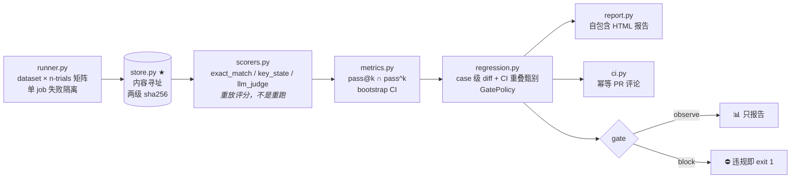

<div align="center">

# AgentLens

**Agent 回归评测门禁与稳定性度量平台——
只回答一个问题：*这个改动能不能合入？***

[](https://www.python.org/)
[](#实测状态)
[](https://docs.astral.sh/ruff/)
[](https://docs.astral.sh/uv/)
[](#免费资源红线)

[English](README.md) · **简体中文**

不是又一个 Langfuse。Langfuse 回答「发生了什么」，
AgentLens 回答「能不能合入」。

</div>

---

## 为什么做这个

对 LLM agent 做单次评测等于在噪声里做决策：同样的代码重跑两遍，pass@1 能波动好几个
百分点。拿一个点估计决定合入还是拦截，本质是掷硬币。AgentLens 把评测升级成**门禁**——
统计学、审计链、judge 问责制全部内建：

| 没有 AgentLens | 有 AgentLens |
|---|---|
| 跑一次、报一个数、靠感觉评审 | n-trials 分布：pass@k（乐观界）与 pass^k（悲观界）**必须一起报** |
| 日志散落在各个 dashboard | 每条轨迹内容寻址落盘（sha256）——防篡改、天然去重、可重放 |
| 「judge 模型说它不行」 | judge 校准闭环：Cohen's κ、position-swap、误杀率——**拦合入的权力要先用数字挣到** |
| scorer 的 bug 上线才发现 | scorer 上岗前必须过 TRAIL 式元体检（对已知好/坏轨迹分辨力满分） |

## 核心原则（不许退化）

1. **Store trajectory first, judge later。** 轨迹先按内容寻址落盘，评分是对历史轨迹的
   重放。换 judge 重判分（`lens rescore`）是一等公民操作，不是重新跑评测。
2. **双侧分布夹逼。** pass@k（Codex 无偏估计器·乐观界）与 pass^k（tau-bench 悲观界）
   成对出现。「小提升」是不是纯噪声，一眼可见。
3. **门禁分级。** `observe` 只报告不阻断；把 `llm_judge` 切到 `block` 必须先过成文的
   七项前提（[judge-block-policy](docs/judge-block-policy.md)：κ ≥ 0.6、误杀 ≤ 2%、
   swap ≥ 95%……）。规则 scorer 不受此约束，可直接 block。
4. **判定与执行解耦。** Scorer 只消费 `Trajectory + task`；每个 scorer 必须可离线测试；
   所有 LLM 访问走 provider 抽象。

## 架构



<details>
<summary><b>模块地图</b>（点开查看）</summary>

| 模块 | 职责 |
|---|---|
| `store.py` ★ | 内容寻址轨迹库（两级 sha256 + run 级索引）；同内容零拷贝去重 |
| `runner.py` | dataset × n-trials 并发矩阵；网络错与任务错分开计数 |
| `scorers.py` | `exact_match`（数值容差）/ `key_state`（BFCL V3 式状态匹配）/ `llm_judge` |
| `metrics.py` | pass@k 无偏估计器 / pass^k 悲观界 / bootstrap CI——数学改动必须过手算回归用例 |
| `regression.py` | case 级 diff（improved/regressed/fragile/unchanged）+ `GatePolicy{observe, block}` |
| `calibration.py` ★ | judge 校准闭环：210 例构造真值池 → 预标注分层 → 人工复核页 → κ 报告 |
| `judge_lab.py` | Cohen's κ、position-swap 一致率、长度偏置体检 |
| `meta_eval.py` | TRAIL 式 scorer 自检：分辨力不满分不上岗（含 security scorer） |
| `robustness.py` | InjecAgent 式工具输出注入套件；utility 率 + 攻击成功率双指标 |
| `trace_analyzer.py` | 失败轨迹聚类（工具错/格式错/规划错/空输出） |
| `export.py` | rollout 导出：Harbor 式 JSONL / AgentRL-Lab schema / OTel collector 推送——eval→RL 飞轮出口 |
| `ci.py` | gate JSON → GitHub PR 评论幂等 upsert |
| `report.py` | 自包含 HTML 报告（内联 CSS、成本记账区、逐题 bootstrap CI 列） |
| `ui.py` | 只读本机 Web UI：runs 列表 / 重放详情 / 门禁对比（纯标准库，绑 127.0.0.1） |

</details>

## 快速上手

```bash
git clone git@github.com:EthyleneC2H4/agent-lens.git && cd agent-lens
uv sync                        # uv 管理，lockfile 入库
uv run pytest -q               # 94 个离线确定性测试，零网络依赖
uv run lens demo               # 两版本评测 → 报告 → 门禁，EXIT=0
uv run lens ui                 # 只读本机 Web UI → http://127.0.0.1:8517
```

本地端到端门禁模拟（无需 GitHub）：

```bash
uv run lens run --version base --n-trials 5 --store-dir /tmp/demo-store
uv run lens run --version cand --n-trials 5 --store-dir /tmp/demo-store
uv run lens gate --store-dir /tmp/demo-store --mode block --out-json gate.json
uv run python scripts/pr_comment.py --gate-json gate.json   # 干跑渲染 PR 评论
```

### 接入你自己的 agent

任何 Python 可调用对象都能成为被评系统——工厂返回 solver，
runner 负责并发、种子与失败隔离：

```bash
uv run lens run --solver-spec "your_pkg.module:create_solver" \
    --dataset tasks.jsonl --version "$(git rev-parse --short HEAD)" --n-trials 8
```

Solver 契约：`create_solver() -> solve(task, trial_seed) -> (output, steps)`。
数据集是 JSONL（`id/input/gold/required_states`，可选 `extra` 元数据通道随轨迹落盘，
供事后任意口径重放）。

## Judge 要校准，不要感觉

一个能拦合入的 LLM judge，其权力必须先用数字挣到：

```bash
uv run lens calibrate          # 构造 210 例校准池 + 成对套件 + 人工复核页
open calib/review.html         # j/k 移动，1/0 裁决——人类只需约 30 分钟
uv run lens kappa-report --pool calib/pool.jsonl --labels labels.jsonl
uv run lens rescore            # 换 judge，重放同一批轨迹
uv run lens meta-eval          # 分辨力满分才允许上岗
```

当前诚实状态：真 judge 预标注与构造真值在 210 例池上一致率 90.5%；
24 组 position-swap 一致率 1.00；**κ vs 真人标注仍待人工会话**——在那之前
`llm_judge` 保持 `observe`。这是策略按设计运行，不是缺陷。

## Eval → RL 飞轮

高质量轨迹从同一个 store 三种格式流出：

| 格式 | 命令 | 下游 |
|---|---|---|
| Harbor 式 rollout JSONL | `lens export --fmt harbor` | 通用 RL/SFT 管线；任务级稳定率筛选（≥ `--min-rate`）挡住侥幸答对 |
| AgentRL-Lab schema | `lens export --fmt agentrl` | 与 AgentRL-Lab `rollout/schema.py` 字段级对齐，契约自检 |
| OTLP/JSON traces | `lens export --fmt otlp [--otel-push URL]` | 任意 OpenTelemetry collector（`/v1/traces`） |

每条记录都携带 store 哈希——下游可回内容寻址库验证溯源。
详见 [docs/export-schema.md](docs/export-schema.md)。

## 实测状态

截至 2026-08-26，以下全部可从本仓库复现：

| 领域 | 状态 |
|---|---|
| 离线测试 | ✅ 94 个全绿，零网络（mock-first 纪律） |
| 门禁管线 | ✅ 注入退化版本被 `block` 模式拦截；CI 噪声甄别（`ci_overlap` 🔥 标记）接入 gate JSON |
| 真实模型通路 | ✅ 免费端点冒烟通过率 1.00（OpenCode Zen · nemotron-3-ultra-free） |
| judge 预标注 | ✅ swap 一致率 1.00（24 组）· 210 例构造池一致率 90.5% |
| 鲁棒性套件 | ✅ 注入用例 + utility/ASR 双指标，离线确定性 |
| 人工 κ 会话 | 🟡 待办——约 30 分钟真人裁决（工具链就绪；禁止 agent 代劳造假） |
| 真实 PR 门禁演示 | 🟡 演示 PR 运行中——绿/红两态确认后截图入 `docs/` |

### 免费资源红线

永远不用付费 API。真实模型只走免费 OpenAI-compatible 池（`AGENTLENS_BASE_URL` /
`AGENTLENS_MODEL` 可覆盖）；key 只从环境变量 `AGENTLENS_API_KEY` 读取，严禁入库。
CI 用 GitHub Actions 免费额度。Mock provider 保证整个离线测试套件确定性、零网络。

## 文档

- [ROADMAP.md](ROADMAP.md) — 逐阶段进度，勾选状态随代码提交
- [AGENTS.md](AGENTS.md) — 工程规约与不变量
- [docs/gate-policy.md](docs/gate-policy.md) — 阈值规则、CI 重叠噪声甄别
- [docs/judge-block-policy.md](docs/judge-block-policy.md) — judge 切 block 的七项前提
- [docs/export-schema.md](docs/export-schema.md) — rollout / AgentRL / OTLP 格式
- [docs/robustness-suite.md](docs/robustness-suite.md) — 注入套件设计与诚实边界

## 方法学致谢

站在已发表工作上：Codex pass@k 估计器（Chen et al.）、τ-bench pass^k（Yao et al.）、
BFCL V3 状态匹配、InjecAgent 注入分类、TRAIL scorer 自检。AgentLens 的贡献是把这些
打包成一个面向合入门禁的工作流——稳定性画像、可重放判定、judge 校准、scorer 认证
都是一等公民。

<div align="center">
<sub>Mock-first 构建 · 诚实计量 · 挣到权力才拦合入</sub>
</div>
